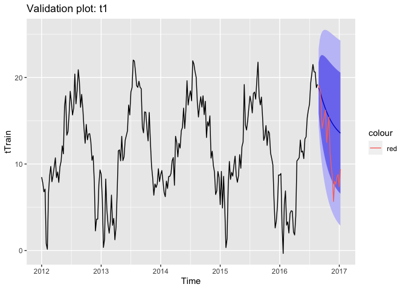
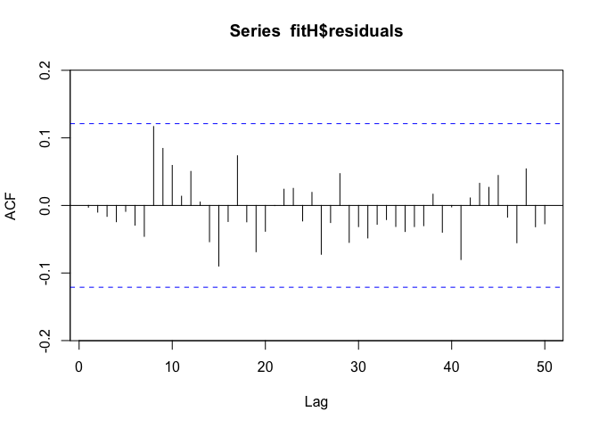

Time Series Analysis of London Bike Sharing
================
Mengfan Ying
11/30/2021

-   [1. Project Goals](#1-project-goals)
-   [2. Dataset Introduction](#2-dataset-introduction)
-   [3. Load Packages](#3-load-packages)
-   [4. Exploratory Data Analysis](#4-exploratory-data-analysis)
    -   [4.1 Five-number summary](#41-five-number-summary)
    -   [4.2 Time Series Plot](#42-time-series-plot)
-   [5. Model Fitting](#5-model-fitting)
    -   [5.1 ARIMA Model](#51-arima-model)
    -   [5.2 Time Series Regression
        Model](#52-time-series-regression-model)
    -   [5.3 Vector Autoregression (VAR)
        Model](#53-vector-autoregression-var-model)
    -   [5.4 Harmonic Regression Model](#54-harmonic-regression-model)
-   [6. Conclusion](#6-conclusion)

## 1. Project Goals

This project aims to utilize historical data of sharing bikes in London
and apply **time series analysis** techniques to predict the weekly
demand of sharing bikes in the future.

## 2. Dataset Introduction

London bike sharing dataset consisted of hourly count of rental bikes
between 1/4/2015 and 1/3/2017 in London with the corresponding weather,
seasonal, and holiday information. The dataset come from Kaggle
<https://www.kaggle.com/hmavrodiev/london-bike-sharing-dataset>, and we
added more data that helped us to get more insight about the seasonal
variations. The data for the following analysis is in the span of 5
years (1/4/12 to 1/3/17). Considering the granularity of time series, we
aggregated hourly data to weekly data.

The important features are:

-   “timestamp” - timestamp field aggregated by week
-   “cnt” - the count of a new bike shares
-   “t1” - real temperature in C
-   “t2” - temperature in C “feels like”
-   “hum” - humidity in percentage
-   “ws” - wind speed in km/h

## 3. Load Packages

``` r
library(lubridate)
library(dplyr)
library(tidyr)
library(dataMaid) 
library(DataExplorer) 
library(ggplot2)   
library(lubridate) 
library(ggfortify) 
library(zoo)      
library(forecast)   
library(TSA)        
library(fUnitRoots)
library(lmtest)
library(tseries)
library(xts)
library(astsa)
library(vars)
library(MASS)
library(strucchange)
library(sandwich)
library(urca)
library(dynlm)
library(astsa)
library(vars)
```

## 4. Exploratory Data Analysis

``` r
bike = read.csv('Weekly.csv')
head(bike)
```

    ##   timestamp      cnt        t1        t2      hum        ws
    ## 1    1/1/12 14599.00 8.4827899  5.284420 72.31159 27.054348
    ## 2    1/8/12 17982.57 7.8257894  6.211739 80.61895 14.431118
    ## 3   1/15/12 16701.43 6.7927019  4.815735 79.41693 16.663837
    ## 4   1/22/12 17243.57 7.0993083  4.617142 78.47214 15.269410
    ## 5   1/29/12 15391.00 0.7956522 -2.006418 75.97164 10.350276
    ## 6    2/5/12 13469.86 0.1446687 -2.039761 83.56505  8.271166

### 4.1 Five-number summary

``` r
summary(bike)
```

    ##   timestamp              cnt              t1                t2        
    ##  Length:262         Min.   : 9268   Min.   :-0.3408   Min.   :-3.180  
    ##  Class :character   1st Qu.:19657   1st Qu.: 8.0124   1st Qu.: 6.124  
    ##  Mode  :character   Median :24930   Median :11.4290   Median :10.578  
    ##                     Mean   :25473   Mean   :11.6914   Mean   :10.599  
    ##                     3rd Qu.:31829   3rd Qu.:16.1471   3rd Qu.:16.059  
    ##                     Max.   :43617   Max.   :22.0190   Max.   :21.935  
    ##       hum              ws        
    ##  Min.   :57.98   Min.   : 8.005  
    ##  1st Qu.:69.99   1st Qu.:12.646  
    ##  Median :75.77   Median :14.336  
    ##  Mean   :74.85   Mean   :14.869  
    ##  3rd Qu.:80.08   3rd Qu.:16.705  
    ##  Max.   :89.81   Max.   :27.054

### 4.2 Time Series Plot

Convert to time series object

``` r
bikeCount = ts(bike$cnt,start = c(2012,1), frequency =  52)
biket1 = ts(bike$t1,start = c(2012,1), frequency = 52)
biket2 = ts(bike$t2,start = c(2012,1), frequency = 52)
bikehumidity = ts(bike$hum,start = c(2012,1), frequency = 52)
bikewindspeed = ts(bike$ws,start = c(2012,1), frequency = 52)
```

``` r
autoplot(bikeCount)
```

<!-- -->

**Figure 4.2** : Time series plot for variable “count”

## 5. Model Fitting

### 5.1 ARIMA Model

#### 5.1.1 Plot ACF, PACF, EACF

``` r
Acf(bikeCount, lag.max=100)
```

<!-- -->

``` r
Pacf(bikeCount, lag.max=100)
```

<!-- -->

``` r
eacf(bikeCount)
```

    ## AR/MA
    ##   0 1 2 3 4 5 6 7 8 9 10 11 12 13
    ## 0 x x x x x x x x x x x  x  o  o 
    ## 1 o o o o o o o x o o o  o  o  o 
    ## 2 x o o o o o o o o o o  o  o  o 
    ## 3 x x x o o o o o o o o  o  o  o 
    ## 4 o x o o o o o o o o o  o  o  o 
    ## 5 x x o o o o o o o o o  o  o  o 
    ## 6 o x o o x o o o o o o  o  o  o 
    ## 7 o o x o x o o o o o o  o  o  o

**We observed:**

-   a cyclic pattern from ACF plot
-   strong autocorrelation at lag 1 and weak autocorrelation at some
    lags before 20
-   potential non-stationary behavior from EACF

#### 5.1.2 Apply Differencing

``` r
Acf(diff(bikeCount), lag.max=100)
```

<!-- -->

**We observed:** Regular (lag 1) differences were computed and despite
some spikes at higher order in ACF plot, the values are around zero.

#### 5.1.3 Examine Stationarity

``` r
adfTest(diff(bikeCount), type="nc")
```

    ## Warning in adfTest(diff(bikeCount), type = "nc"): p-value smaller than printed
    ## p-value

    ## 
    ## Title:
    ##  Augmented Dickey-Fuller Test
    ## 
    ## Test Results:
    ##   PARAMETER:
    ##     Lag Order: 1
    ##   STATISTIC:
    ##     Dickey-Fuller: -13.7141
    ##   P VALUE:
    ##     0.01 
    ## 
    ## Description:
    ##  Tue Dec 28 14:57:32 2021 by user:

``` r
adfTest(diff(bikeCount), type="c") 
```

    ## Warning in adfTest(diff(bikeCount), type = "c"): p-value smaller than printed p-
    ## value

    ## 
    ## Title:
    ##  Augmented Dickey-Fuller Test
    ## 
    ## Test Results:
    ##   PARAMETER:
    ##     Lag Order: 1
    ##   STATISTIC:
    ##     Dickey-Fuller: -13.6874
    ##   P VALUE:
    ##     0.01 
    ## 
    ## Description:
    ##  Tue Dec 28 14:57:32 2021 by user:

``` r
adfTest(diff(bikeCount), type="ct") 
```

    ## Warning in adfTest(diff(bikeCount), type = "ct"): p-value smaller than printed
    ## p-value

    ## 
    ## Title:
    ##  Augmented Dickey-Fuller Test
    ## 
    ## Test Results:
    ##   PARAMETER:
    ##     Lag Order: 1
    ##   STATISTIC:
    ##     Dickey-Fuller: -13.6953
    ##   P VALUE:
    ##     0.01 
    ## 
    ## Description:
    ##  Tue Dec 28 14:57:32 2021 by user:

``` r
kpss.test(diff(bikeCount), null = "Level") 
```

    ## Warning in kpss.test(diff(bikeCount), null = "Level"): p-value greater than
    ## printed p-value

    ## 
    ##  KPSS Test for Level Stationarity
    ## 
    ## data:  diff(bikeCount)
    ## KPSS Level = 0.091083, Truncation lag parameter = 5, p-value = 0.1

``` r
kpss.test(diff(bikeCount), null = "Trend") 
```

    ## Warning in kpss.test(diff(bikeCount), null = "Trend"): p-value greater than
    ## printed p-value

    ## 
    ##  KPSS Test for Trend Stationarity
    ## 
    ## data:  diff(bikeCount)
    ## KPSS Trend = 0.040743, Truncation lag parameter = 5, p-value = 0.1

**We observed:** Both Dickey-Fuller and KPSS tests indicate differenced
data at lag 1 was stationary.

#### 5.1.4 Fit ARIMA Model

``` r
fitM = Arima(bikeCount, order=c(1, 0, 0), seasonal=list(order=c(1, 1, 0), seasonal=52))
fitM
```

    ## Series: bikeCount 
    ## ARIMA(1,0,0)(1,1,0)[52] 
    ## 
    ## Coefficients:
    ##          ar1     sar1
    ##       0.5707  -0.4383
    ## s.e.  0.0566   0.0682
    ## 
    ## sigma^2 estimated as 19252874:  log likelihood=-2063.9
    ## AIC=4133.79   AICc=4133.91   BIC=4143.84

``` r
coeftest(fitM)
```

    ## 
    ## z test of coefficients:
    ## 
    ##       Estimate Std. Error z value  Pr(>|z|)    
    ## ar1   0.570746   0.056558 10.0913 < 2.2e-16 ***
    ## sar1 -0.438288   0.068175 -6.4289 1.286e-10 ***
    ## ---
    ## Signif. codes:  0 '***' 0.001 '**' 0.01 '*' 0.05 '.' 0.1 ' ' 1

``` r
fitA = auto.arima(bikeCount, seasonal = T)
fitA
```

    ## Series: bikeCount 
    ## ARIMA(2,0,2)(1,1,0)[52] with drift 
    ## 
    ## Coefficients:
    ##          ar1     ar2     ma1     ma2     sar1    drift
    ##       0.1285  0.2336  0.3881  0.0322  -0.4689  18.0898
    ## s.e.  0.9326  0.6267  0.9263  0.2131   0.0685   9.4031
    ## 
    ## sigma^2 estimated as 19084331:  log likelihood=-2061.82
    ## AIC=4137.65   AICc=4138.2   BIC=4161.08

``` r
coeftest(fitA)
```

    ## 
    ## z test of coefficients:
    ## 
    ##        Estimate Std. Error z value  Pr(>|z|)    
    ## ar1    0.128455   0.932627  0.1377   0.89045    
    ## ar2    0.233622   0.626688  0.3728   0.70931    
    ## ma1    0.388115   0.926320  0.4190   0.67523    
    ## ma2    0.032153   0.213129  0.1509   0.88009    
    ## sar1  -0.468873   0.068513 -6.8436 7.725e-12 ***
    ## drift 18.089800   9.403084  1.9238   0.05438 .  
    ## ---
    ## Signif. codes:  0 '***' 0.001 '**' 0.01 '*' 0.05 '.' 0.1 ' ' 1

**We concluded:** Manually fitted model performs better than
automatically generated model. For Manually fitted model, both
coefficients are statistically significant.

#### 5.1.5 Check Model Adequacy

``` r
autoplot(fitM$residuals)
```

<!-- -->

``` r
Acf(fitM$residuals, lag.max=100)
```

<!-- -->

``` r
Box.test(fitM$residuals, lag=10, type="Ljung")
```

    ## 
    ##  Box-Ljung test
    ## 
    ## data:  fitM$residuals
    ## X-squared = 11.056, df = 10, p-value = 0.3532

**We observed:**

-   from the autoplot, the residuals of fitM model are not completely
    white noise because we still saw some autocorrelations
-   some spikes are coming out at some lags from the ACF plot
-   However, the Ljung-Box test failed to reject the null hypothesis. In
    other words, the residuals are white noise!

#### 5.1.6 Validation

``` r
length(bikeCount)
```

    ## [1] 262

``` r
train = subset(bikeCount, end=242)
validate = subset(bikeCount, start=243)

fitV = Arima(train, order=c(1, 0, 0), seasonal=list(order=c(1, 1, 0), seasonal=52))

ptrain = forecast(fitV, h=20)
plot(ptrain, xlim=c(2012,2017))
lines(validate, col='red')
```

<!-- -->

**We observed:** The model was validated using a 90%/10% split, the blue
line is the forecasted data, and the red line is the original data. We
could see two lines follow a similar trend despite some gaps.

#### 5.1.7 Forecast

``` r
plot(forecast(fitM, xreg=2017:2019))
```

    ## Warning in forecast.forecast_ARIMA(fitM, xreg = 2017:2019): xreg not required by
    ## this model, ignoring the provided regressors

``` r
title(sub = "Forecast of London Bike Sharing Counts from 2017 to 2020")
```

<!-- -->

**We observed:** The forecasts of bike sharing counts for next two years
was shown above. We could observe that the cyclic pattern of next two
years looks quite similar to the data from 2012 to 2017.

### 5.2 Time Series Regression Model

#### 5.2.1 Examine Correlation

*Correlation Analysis*

``` r
cor(bikeCount, biket1)
```

    ## [1] 0.7591956

``` r
s = ts(cbind(bikeCount, biket1), class="mts") 
autoplot(s, facets = T)    
```

<!-- -->

*Apply lag2.plot and ccf to check lagged regression*

``` r
lag2.plot(as.numeric(bikeCount), as.numeric(biket1), 8) 
```

<!-- -->

``` r
ccf(as.numeric(bikeCount), as.numeric(biket1))
```

<!-- -->

#### 5.2.2 Fit OLS Regression Model

We regard “cnt” as our primary variable. Therefore, we would like to
spend a little more time fitting a model for forecasting “cnt.” By
plotting the correlation between variables, we found that the other
secondary variables have some correlation with the variable “cnt.”
Hence, we could regress variable “cnt” on the secondary variables and
fit an ARIMA model for the residuals. Since we found the strongest
correlation between “cnt” and “t1”, we first fitted an OLS regression
model fit0:

*f**i**t*0 = *l**m*(*b**i**k**e**C**o**u**n**t* *b**i**k**e**t*1)

``` r
fit0 = lm(bikeCount ~ biket1)
summary(fit0)
```

    ## 
    ## Call:
    ## lm(formula = bikeCount ~ biket1)
    ## 
    ## Residuals:
    ##      Min       1Q   Median       3Q      Max 
    ## -16253.4  -3312.2    448.7   3093.2  12431.9 
    ## 
    ## Coefficients:
    ##             Estimate Std. Error t value Pr(>|t|)    
    ## (Intercept) 13262.26     713.41   18.59   <2e-16 ***
    ## biket1       1044.43      55.53   18.81   <2e-16 ***
    ## ---
    ## Signif. codes:  0 '***' 0.001 '**' 0.01 '*' 0.05 '.' 0.1 ' ' 1
    ## 
    ## Residual standard error: 4787 on 260 degrees of freedom
    ## Multiple R-squared:  0.5764, Adjusted R-squared:  0.5747 
    ## F-statistic: 353.8 on 1 and 260 DF,  p-value: < 2.2e-16

``` r
Box.test(fit0$residuals, lag=10, type="Ljung")
```

    ## 
    ##  Box-Ljung test
    ## 
    ## data:  fit0$residuals
    ## X-squared = 301.44, df = 10, p-value < 2.2e-16

**We observed:**

-   Coefficients are statistically significant
-   Residuals of model fit0 are not white noise

#### 5.2.3 Examine ACF and PACF of residuals

``` r
plot(fit0$residuals, type="l")
```

<!-- -->

``` r
Acf(fit0$residuals, lag.max = 100)
```

<!-- -->

``` r
pacf(fit0$residuals, lag.max = 100)
```

<!-- -->

``` r
eacf (fit0$residuals)
```

    ## AR/MA
    ##   0 1 2 3 4 5 6 7 8 9 10 11 12 13
    ## 0 x x x x x x x x x x x  x  o  o 
    ## 1 o o x o o o o o x o o  o  o  o 
    ## 2 x o o x o o o o o o o  o  o  o 
    ## 3 x x o x o o o o o o o  o  o  o 
    ## 4 x x x o o o o o o o o  o  o  o 
    ## 5 x x x x o x o o o o o  o  o  o 
    ## 6 x x x o x x o o o o o  o  o  o 
    ## 7 x x o o o x x o o o o  o  o  o

**We observed:** The residuals might contain some non-stationary
behaviors.

#### 5.2.4 Apply Differencing

``` r
plot(diff(fit0$residuals), type="l")
```

<!-- -->

``` r
Acf(diff(fit0$residuals), lag.max = 100)
```

<!-- -->

``` r
pacf(diff(fit0$residuals), lag.max = 100)
```

<!-- -->

``` r
eacf (diff(fit0$residuals))
```

    ## AR/MA
    ##   0 1 2 3 4 5 6 7 8 9 10 11 12 13
    ## 0 x o x o o o o o x o o  o  o  o 
    ## 1 x o o x o o o o o o o  o  o  o 
    ## 2 x x o x o o o o o o o  o  o  o 
    ## 3 x x x o o x o o o o o  o  o  o 
    ## 4 x x x x o x o o o o o  o  o  o 
    ## 5 x x x x x x o o o o o  o  o  o 
    ## 6 x x o o o x x o o o o  o  o  o 
    ## 7 x x o x o x x o o o o  o  o  o

**We concluded:**

-   We did not observe much autocorrelation in the ACF of difference
-   EACF suggests an ARMA (1, 1) model

#### 5.2.5 Fit Regression Model

``` r
fitA = auto.arima(bikeCount, xreg=biket1)
summary(fitA)
```

    ## Series: bikeCount 
    ## Regression with ARIMA(2,1,4)(1,0,1)[52] errors 
    ## 
    ## Coefficients:
    ##           ar1      ar2      ma1     ma2      ma3      ma4    sar1     sma1
    ##       -0.1295  -0.6144  -0.1974  0.3845  -0.4639  -0.2034  0.4271  -0.2537
    ## s.e.   0.2174   0.1801   0.2300  0.2121   0.0627   0.0907  0.3168   0.3351
    ##           xreg
    ##       767.0567
    ## s.e.  100.2693
    ## 
    ## sigma^2 estimated as 12356349:  log likelihood=-2498.21
    ## AIC=5016.41   AICc=5017.29   BIC=5052.06
    ## 
    ## Training set error measures:
    ##                    ME     RMSE      MAE       MPE     MAPE      MASE
    ## Training set 38.81778 3447.424 2634.758 -1.661228 11.43512 0.5564319
    ##                     ACF1
    ## Training set 0.003065393

``` r
coeftest(fitA)
```

    ## 
    ## z test of coefficients:
    ## 
    ##        Estimate Std. Error z value  Pr(>|z|)    
    ## ar1   -0.129455   0.217422 -0.5954 0.5515682    
    ## ar2   -0.614438   0.180118 -3.4113 0.0006465 ***
    ## ma1   -0.197401   0.229971 -0.8584 0.3906885    
    ## ma2    0.384542   0.212135  1.8127 0.0698751 .  
    ## ma3   -0.463938   0.062666 -7.4033 1.328e-13 ***
    ## ma4   -0.203393   0.090715 -2.2421 0.0249549 *  
    ## sar1   0.427086   0.316782  1.3482 0.1775934    
    ## sma1  -0.253669   0.335071 -0.7571 0.4490128    
    ## xreg 767.056742 100.269327  7.6500 2.010e-14 ***
    ## ---
    ## Signif. codes:  0 '***' 0.001 '**' 0.01 '*' 0.05 '.' 0.1 ' ' 1

``` r
fitM = Arima(bikeCount, xreg=biket1, order=c(1, 1, 1), seasonal=list(order=c(1, 0, 0), seasonal=52))
summary(fitM)
```

    ## Series: bikeCount 
    ## Regression with ARIMA(1,1,1)(1,0,0)[52] errors 
    ## 
    ## Coefficients:
    ##          ar1      ma1    sar1      xreg
    ##       0.5689  -0.9061  0.1897  738.5116
    ## s.e.  0.1787   0.1423  0.0692  118.4341
    ## 
    ## sigma^2 estimated as 12685948:  log likelihood=-2504.07
    ## AIC=5018.14   AICc=5018.37   BIC=5035.96
    ## 
    ## Training set error measures:
    ##                    ME     RMSE      MAE       MPE     MAPE      MASE       ACF1
    ## Training set 74.85553 3527.584 2699.611 -1.770142 11.68679 0.5701281 0.02620713

``` r
coeftest(fitM)
```

    ## 
    ## z test of coefficients:
    ## 
    ##        Estimate Std. Error z value  Pr(>|z|)    
    ## ar1    0.568913   0.178694  3.1837  0.001454 ** 
    ## ma1   -0.906136   0.142309 -6.3674 1.923e-10 ***
    ## sar1   0.189736   0.069204  2.7417  0.006112 ** 
    ## xreg 738.511581 118.434106  6.2356 4.500e-10 ***
    ## ---
    ## Signif. codes:  0 '***' 0.001 '**' 0.01 '*' 0.05 '.' 0.1 ' ' 1

**We observed:**

-   The auto.arima function suggests an MA (2) model, but the
    coefficient of the seasonality parameter is about in the edge.
-   For manually fitted model, an AR (1) MA (1) model works better. All
    the coefficients are statistically significant.

#### 5.2.6 Check Model Adequacy

``` r
autoplot(fitM$residuals) 
```

<!-- -->

``` r
Acf(fitM$residuals, lag.max=100)
```

<!-- -->

``` r
Box.test(fitM$residuals, lag=10, type="Ljung")
```

    ## 
    ##  Box-Ljung test
    ## 
    ## data:  fitM$residuals
    ## X-squared = 13.548, df = 10, p-value = 0.1946

``` r
autoplot(fitA$residuals) #fitM/fitA
```

<!-- -->

``` r
Acf(fitA$residuals, lag.max=100)
```

<!-- -->

``` r
Box.test(fitA$residuals, lag=10, type="Ljung")
```

    ## 
    ##  Box-Ljung test
    ## 
    ## data:  fitA$residuals
    ## X-squared = 5.9106, df = 10, p-value = 0.8227

**We concluded:**

-   Both models can capture the variance rather well
-   For automatically fitted model(fitA), we still observed some
    autocorrelation at around lag ten. And the p-value of the Ljung-Box
    is about in the edge, suggesting that we might or might not reject
    white noise depending on the confidence level we set
-   Manually fitted model(fitM) has slightly better performance because
    there is no autocorrelation in residuals and the Ljung-Box suggests
    that we fail to reject white noise with a high confidence level

#### 5.2.7 Validation

*We held the last 20 data points and validated the fitM model. *

``` r
C_train = subset(bikeCount, end=242)    
T_train = subset(biket1, end=242)
C_test = subset(bikeCount, start=243)
T_test = subset(biket1, start=243)

fitTrain = Arima(C_train, xreg=T_train, order=c(1, 1, 1), seasonal=list(order=c(1, 0, 0), seasonal=52))

plot(forecast(fitTrain, xreg=T_test)) 
lines(as.numeric(time(C_test)), as.numeric(C_test), col="red")
```

<!-- -->

**We concluded:** Compared with the ARIMA model in 5.2.6, we found that
the model including regression does a better job capturing details.

#### 5.2.8 Forecast

*We use the fitM model to forecast the weekly number of bike-sharing for
the next two years.*

``` r
plot(forecast(fitM, xreg=biket1), xlim=c(2012, 2020))
title(sub = "Forecast of London Bike Sharing Counts from 2017 to 2020")
```

<!-- -->

**We observed:**

-   Compared with the ARIMA model in 5.1.7, both models can capture the
    seasonal trend rather well.
-   The big difference between these two models is the confidence
    interval. The confidence interval becomes wider when time goes by in
    the regression model. In contrast, the confidence interval keeps
    narrow in the ARIMA model.

### 5.3 Vector Autoregression (VAR) Model

Vector Autoregression Model was applied to explore the multivariate
relationships between bike counts and rest of variables. Three
relationships were explored as follows: count vs.t1, count vs. humidity,
and count vs. windspeed.

Three steps will be done:

-   step 1: Use cross correlation function (CCF) to check lagged
    regressions
-   step 2: Fit model
-   step 3: Validation

#### 5.3.1 count vs.t1

##### 5.3.1.1 Step 1

``` r
ccf(as.numeric(bikeCount), as.numeric(biket1))
```

<!-- -->

``` r
s1 = VARselect(cbind(bikeCount, biket1), lag.max=8, type="const")
s1
```

    ## $selection
    ## AIC(n)  HQ(n)  SC(n) FPE(n) 
    ##      1      1      1      1 
    ## 
    ## $criteria
    ##                   1            2            3            4            5
    ## AIC(n) 1.798563e+01 1.799947e+01 1.801650e+01 1.802731e+01 1.801288e+01
    ## HQ(n)  1.801924e+01 1.805549e+01 1.809494e+01 1.812815e+01 1.813613e+01
    ## SC(n)  1.806919e+01 1.813873e+01 1.821148e+01 1.827798e+01 1.831926e+01
    ## FPE(n) 6.472318e+07 6.562555e+07 6.675453e+07 6.748167e+07 6.651816e+07
    ##                   6            7            8
    ## AIC(n) 1.803213e+01 1.800733e+01 1.799758e+01
    ## HQ(n)  1.817779e+01 1.817541e+01 1.818806e+01
    ## SC(n)  1.839422e+01 1.842513e+01 1.847108e+01
    ## FPE(n) 6.781608e+07 6.616139e+07 6.552741e+07

##### 5.3.1.2 Step 2

``` r
fit1 = VAR(cbind(bikeCount, biket1), p=1, type="const")
fit1
```

    ## 
    ## VAR Estimation Results:
    ## ======================= 
    ## 
    ## Estimated coefficients for equation bikeCount: 
    ## ============================================== 
    ## Call:
    ## bikeCount = bikeCount.l1 + biket1.l1 + const 
    ## 
    ## bikeCount.l1    biket1.l1        const 
    ##    0.7322373  213.9723742 4322.6713363 
    ## 
    ## 
    ## Estimated coefficients for equation biket1: 
    ## =========================================== 
    ## Call:
    ## biket1 = bikeCount.l1 + biket1.l1 + const 
    ## 
    ## bikeCount.l1    biket1.l1        const 
    ## 8.077323e-05 8.190083e-01 5.963259e-02

``` r
serial.test(fit1, lags.pt=10, type="PT.asymptotic")
```

    ## 
    ##  Portmanteau Test (asymptotic)
    ## 
    ## data:  Residuals of VAR object fit1
    ## Chi-squared = 51.463, df = 36, p-value = 0.04568

``` r
coeftest(fit1)
```

    ## 
    ## t test of coefficients:
    ## 
    ##                          Estimate Std. Error t value  Pr(>|t|)    
    ## bikeCount:(Intercept)  4.3227e+03 8.7311e+02  4.9509 1.336e-06 ***
    ## bikeCount:bikeCount.l1 7.3224e-01 4.9738e-02 14.7220 < 2.2e-16 ***
    ## bikeCount:biket1.l1    2.1397e+02 6.8040e+01  3.1448  0.001857 ** 
    ## biket1:(Intercept)     5.9633e-02 5.2049e-01  0.1146  0.908875    
    ## biket1:bikeCount.l1    8.0773e-05 2.9650e-05  2.7242  0.006886 ** 
    ## biket1:biket1.l1       8.1901e-01 4.0561e-02 20.1921 < 2.2e-16 ***
    ## ---
    ## Signif. codes:  0 '***' 0.001 '**' 0.01 '*' 0.05 '.' 0.1 ' ' 1

``` r
autoplot(forecast(fit1, h=60))
```

<!-- -->

##### 5.3.1.3 Step 3

``` r
cTrain = subset(bikeCount, end=242)
cTest = subset(bikeCount, start=243)
tTrain = subset(biket1, end=242)
tTest = subset(biket1, start=243)

fitCombined = VAR(cbind(cTrain, tTrain), p=1, type="const")
f = forecast(fitCombined, h=20, newdata=cbind(cTest, tTest))

fore = f$forecast
autoplot(fore$cTrain) + 
  geom_line(aes(x=time(cTest), y=cTest, color="red")) + 
  ggtitle('Validation plot: count')
```

<!-- -->

``` r
autoplot(fore$tTrain) + 
  geom_line(aes(x=time(tTest), y=tTest, color="red")) + 
  ggtitle('Validation plot: t1')
```

<!-- -->

#### 5.3.2 count vs. humidity

##### 5.3.2.1 Step 1

``` r
ccf(as.numeric(bikeCount), as.numeric(bikehumidity))
```

<!-- -->

``` r
s2 = VARselect(cbind(bikeCount, bikehumidity), lag.max=8, type="const")
s2
```

    ## $selection
    ## AIC(n)  HQ(n)  SC(n) FPE(n) 
    ##      8      2      1      8 
    ## 
    ## $criteria
    ##                   1            2            3            4            5
    ## AIC(n) 1.985532e+01 1.982867e+01 1.982506e+01 1.980873e+01 1.979463e+01
    ## HQ(n)  1.988894e+01 1.988469e+01 1.990349e+01 1.990958e+01 1.991788e+01
    ## SC(n)  1.993888e+01 1.996793e+01 2.002003e+01 2.005941e+01 2.010101e+01
    ## FPE(n) 4.198152e+08 4.087755e+08 4.073096e+08 4.007279e+08 3.951335e+08
    ##                   6            7            8
    ## AIC(n) 1.978009e+01 1.975690e+01 1.974436e+01
    ## HQ(n)  1.992575e+01 1.992498e+01 1.993484e+01
    ## SC(n)  2.014218e+01 2.017470e+01 2.021786e+01
    ## FPE(n) 3.894573e+08 3.805696e+08 3.758726e+08

##### 5.3.2.2 Step 2

``` r
fit2 = VAR(cbind(bikeCount, bikehumidity), p=2, type="const")
fit2
```

    ## 
    ## VAR Estimation Results:
    ## ======================= 
    ## 
    ## Estimated coefficients for equation bikeCount: 
    ## ============================================== 
    ## Call:
    ## bikeCount = bikeCount.l1 + bikehumidity.l1 + bikeCount.l2 + bikehumidity.l2 + const 
    ## 
    ##    bikeCount.l1 bikehumidity.l1    bikeCount.l2 bikehumidity.l2           const 
    ##    7.141678e-01   -4.577093e+01    5.915065e-02   -1.220020e+02    1.832732e+04 
    ## 
    ## 
    ## Estimated coefficients for equation bikehumidity: 
    ## ================================================= 
    ## Call:
    ## bikehumidity = bikeCount.l1 + bikehumidity.l1 + bikeCount.l2 + bikehumidity.l2 + const 
    ## 
    ##    bikeCount.l1 bikehumidity.l1    bikeCount.l2 bikehumidity.l2           const 
    ##   -1.750379e-04    3.901132e-01    1.651637e-05    1.835796e-01    3.595960e+01

``` r
serial.test(fit2, lags.pt=10, type="PT.asymptotic")
```

    ## 
    ##  Portmanteau Test (asymptotic)
    ## 
    ## data:  Residuals of VAR object fit2
    ## Chi-squared = 59.688, df = 32, p-value = 0.002114

``` r
coeftest(fit2)
```

    ## 
    ## t test of coefficients:
    ## 
    ##                                 Estimate  Std. Error t value  Pr(>|t|)    
    ## bikeCount:(Intercept)         1.8327e+04  4.4666e+03  4.1032 5.487e-05 ***
    ## bikeCount:bikeCount.l1        7.1417e-01  6.4635e-02 11.0492 < 2.2e-16 ***
    ## bikeCount:bikehumidity.l1    -4.5771e+01  4.5296e+01 -1.0105  0.313225    
    ## bikeCount:bikeCount.l2        5.9151e-02  6.2877e-02  0.9407  0.347734    
    ## bikeCount:bikehumidity.l2    -1.2200e+02  4.5608e+01 -2.6750  0.007956 ** 
    ## bikehumidity:(Intercept)      3.5960e+01  6.3686e+00  5.6464 4.361e-08 ***
    ## bikehumidity:bikeCount.l1    -1.7504e-04  9.2160e-05 -1.8993  0.058655 .  
    ## bikehumidity:bikehumidity.l1  3.9011e-01  6.4585e-02  6.0403 5.417e-09 ***
    ## bikehumidity:bikeCount.l2     1.6516e-05  8.9653e-05  0.1842  0.853983    
    ## bikehumidity:bikehumidity.l2  1.8358e-01  6.5029e-02  2.8230  0.005133 ** 
    ## ---
    ## Signif. codes:  0 '***' 0.001 '**' 0.01 '*' 0.05 '.' 0.1 ' ' 1

``` r
autoplot(forecast(fit2, h=60))
```

<!-- -->

##### 5.3.2.3 Step 3

``` r
cTrain = subset(bikeCount, end=242)
cTest = subset(bikeCount, start=243)
tTrain = subset(bikehumidity, end=242)
tTest = subset(bikehumidity, start=243)

fitCombined = VAR(cbind(cTrain, tTrain), p=2, type="const")
f = forecast(fitCombined, h=20, newdata=cbind(cTest, tTest))

fore = f$forecast
autoplot(fore$cTrain) + 
  geom_line(aes(x=time(cTest), y=cTest, color="red")) +
  ggtitle('Validation plot: count')
```

<!-- -->

``` r
autoplot(fore$tTrain) + 
  geom_line(aes(x=time(tTest), y=tTest, color="red")) +
  ggtitle('Validation plot: humidity')
```

<!-- -->

#### 5.3.3 count vs. windspeed

##### 5.3.3.1 Step 1

``` r
ccf(as.numeric(bikeCount), as.numeric(bikewindspeed))
```

<!-- -->

``` r
s3 = VARselect(cbind(bikeCount, bikewindspeed), lag.max=8, type="const")
s3
```

    ## $selection
    ## AIC(n)  HQ(n)  SC(n) FPE(n) 
    ##      1      1      1      1 
    ## 
    ## $criteria
    ##                   1            2            3            4            5
    ## AIC(n) 1.881233e+01 1.882752e+01 1.881662e+01 1.882410e+01 1.883470e+01
    ## HQ(n)  1.884594e+01 1.888355e+01 1.889506e+01 1.892494e+01 1.895795e+01
    ## SC(n)  1.889588e+01 1.896679e+01 1.901159e+01 1.907478e+01 1.914108e+01
    ## FPE(n) 1.479415e+08 1.502082e+08 1.485825e+08 1.497021e+08 1.513046e+08
    ##                   6            7            8
    ## AIC(n) 1.884430e+01 1.887073e+01 1.890103e+01
    ## HQ(n)  1.898996e+01 1.903881e+01 1.909152e+01
    ## SC(n)  1.920638e+01 1.928853e+01 1.937453e+01
    ## FPE(n) 1.527746e+08 1.568825e+08 1.617292e+08

##### 5.3.3.2 Step 2

``` r
fit3 = VAR(cbind(bikeCount, bikewindspeed), p=1, type="const")
fit3
```

    ## 
    ## VAR Estimation Results:
    ## ======================= 
    ## 
    ## Estimated coefficients for equation bikeCount: 
    ## ============================================== 
    ## Call:
    ## bikeCount = bikeCount.l1 + bikewindspeed.l1 + const 
    ## 
    ##     bikeCount.l1 bikewindspeed.l1            const 
    ##        0.8465045      -40.2575746     4507.4567592 
    ## 
    ## 
    ## Estimated coefficients for equation bikewindspeed: 
    ## ================================================== 
    ## Call:
    ## bikewindspeed = bikeCount.l1 + bikewindspeed.l1 + const 
    ## 
    ##     bikeCount.l1 bikewindspeed.l1            const 
    ##    -5.747534e-05     1.674123e-01     1.380428e+01

``` r
serial.test(fit3, lags.pt=10, type="PT.asymptotic")
```

    ## 
    ##  Portmanteau Test (asymptotic)
    ## 
    ## data:  Residuals of VAR object fit3
    ## Chi-squared = 44.163, df = 36, p-value = 0.1648

``` r
coeftest(fit3)
```

    ## 
    ## t test of coefficients:
    ## 
    ##                                   Estimate  Std. Error t value  Pr(>|t|)    
    ## bikeCount:(Intercept)           4.5075e+03  1.6009e+03  2.8156  0.005245 ** 
    ## bikeCount:bikeCount.l1          8.4650e-01  3.4045e-02 24.8646 < 2.2e-16 ***
    ## bikeCount:bikewindspeed.l1     -4.0258e+01  7.5093e+01 -0.5361  0.592351    
    ## bikewindspeed:(Intercept)       1.3804e+01  1.3089e+00 10.5468 < 2.2e-16 ***
    ## bikewindspeed:bikeCount.l1     -5.7475e-05  2.7834e-05 -2.0649  0.039928 *  
    ## bikewindspeed:bikewindspeed.l1  1.6741e-01  6.1394e-02  2.7268  0.006833 ** 
    ## ---
    ## Signif. codes:  0 '***' 0.001 '**' 0.01 '*' 0.05 '.' 0.1 ' ' 1

``` r
autoplot(forecast(fit3, h=60))
```

<!-- -->

##### 5.3.3.3 Step 3

``` r
cTrain = subset(bikeCount, end=242)
cTest = subset(bikeCount, start=243)
tTrain = subset(bikewindspeed, end=242)
tTest = subset(bikewindspeed, start=243)

fitCombined = VAR(cbind(cTrain, tTrain), p=1, type="const")
f = forecast(fitCombined, h=20, newdata=cbind(cTest, tTest))

fore = f$forecast
autoplot(fore$cTrain) + 
  geom_line(aes(x=time(cTest), y=cTest, color="red")) +
  ggtitle('Validation plot: count')
```

<!-- -->

``` r
autoplot(fore$tTrain) + 
  geom_line(aes(x=time(tTest), y=tTest, color="red")) +
  ggtitle('Validation plot: windspeed')
```

<!-- -->

**We concluded:**

-   Only variable humidity has some lagged correlation with variable
    count
-   VAR model can only capture the trend but fails to capture the
    details
-   VAR model does a decent job predicting the very near future data,
    but the prediction tends to level off to the mean eventually.

### 5.4 Harmonic Regression Model

#### 5.4.1 Run a loess fit on the data

``` r
loess10 = loess(bikeCount ~ time(bikeCount), data = bikeCount, span = 0.1)
plot(loess10$fitted, type = 'l')
```

<!-- -->

``` r
smoothed10 = predict(loess10)
smoothed10_ts = ts(smoothed10, start = 2012, frequency = frequency(bikeCount))

loess30 = loess(bikeCount ~ time(bikeCount), data = bikeCount, span=0.3)
plot(loess30$fitted, type = 'l')
```

<!-- -->

``` r
smoothed30 = predict(loess30)
smoothed30_ts = ts(smoothed30, start = 2012, frequency = frequency(bikeCount))
plot(bikeCount)
lines(smoothed10_ts, col="red", lwd=2)
lines(smoothed30_ts, col="blue", lwd=2)
```

<!-- -->

#### 5.4.2 Analyze the Spectral Density of the residual series

``` r
res10 = ts(loess10$residuals, start = 2012, frequency = frequency(bikeCount))
head(res10)
```

    ## Time Series:
    ## Start = c(2012, 1) 
    ## End = c(2012, 6) 
    ## Frequency = 52 
    ## [1]   626.3681  2977.7096   713.1201   320.3691 -2418.7737 -5164.6485

``` r
autoplot(res10)
```

<!-- -->

``` r
spect = spectrum(res10, log="no", spans=c(2, 2), plot=T, xlab="Frequency (Cycles/Year)")
```

<!-- -->

**We observed:** Three relatively strong frequency

#### 5.4.3 Fit Harmonic Model

``` r
fitH = auto.arima(bikeCount, xreg = fourier(bikeCount, K=3), seasonal = FALSE)
summary(fitH)
```

    ## Series: bikeCount 
    ## Regression with ARIMA(0,1,3) errors 
    ## 
    ## Coefficients:
    ##           ma1      ma2      ma3       S1-52       C1-52     S2-52      C2-52
    ##       -0.4444  -0.2479  -0.2025  -3478.6036  -7576.8812  939.9742  -548.7668
    ## s.e.   0.0605   0.0668   0.0649    576.4428    559.6632  512.1997   506.4082
    ##           S3-52      C3-52
    ##       -527.2806  -206.2005
    ## s.e.   491.1048   488.7142
    ## 
    ## sigma^2 estimated as 12292890:  log likelihood=-2496.81
    ## AIC=5013.63   AICc=5014.51   BIC=5049.27
    ## 
    ## Training set error measures:
    ##                   ME    RMSE      MAE       MPE     MAPE      MASE         ACF1
    ## Training set 127.743 3438.56 2660.285 -1.529764 11.54767 0.5618228 -0.002649803

``` r
coeftest(fitH)
```

    ## 
    ## z test of coefficients:
    ## 
    ##          Estimate  Std. Error  z value  Pr(>|z|)    
    ## ma1   -4.4436e-01  6.0548e-02  -7.3390 2.152e-13 ***
    ## ma2   -2.4785e-01  6.6838e-02  -3.7082 0.0002087 ***
    ## ma3   -2.0253e-01  6.4907e-02  -3.1202 0.0018070 ** 
    ## S1-52 -3.4786e+03  5.7644e+02  -6.0346 1.594e-09 ***
    ## C1-52 -7.5769e+03  5.5966e+02 -13.5383 < 2.2e-16 ***
    ## S2-52  9.3997e+02  5.1220e+02   1.8352 0.0664803 .  
    ## C2-52 -5.4877e+02  5.0641e+02  -1.0836 0.2785221    
    ## S3-52 -5.2728e+02  4.9110e+02  -1.0737 0.2829742    
    ## C3-52 -2.0620e+02  4.8871e+02  -0.4219 0.6730802    
    ## ---
    ## Signif. codes:  0 '***' 0.001 '**' 0.01 '*' 0.05 '.' 0.1 ' ' 1

#### 5.4.4 Check Model Adequacy

``` r
autoplot(fitH$residuals)
```

<!-- -->

``` r
Acf(fitH$residuals, lag.max = 50)
```

<!-- -->

``` r
Box.test(fitH$residuals, lag = 50, type = 'Ljung-Box')
```

    ## 
    ##  Box-Ljung test
    ## 
    ## data:  fitH$residuals
    ## X-squared = 28.099, df = 50, p-value = 0.9948

**We concluded:** the residuals of the harmonic model(fitH) is white
noise

#### 5.4.5 Forecast

``` r
autoplot(forecast(fitH, xreg = fourier(bikeCount, K=3, h=100)))
```

<!-- -->

**We concluded:**

-   The harmonic model can predict the data by capturing the seasonal
    pattern well
-   Like VAR model, it fails to capture the details
-   The confidence interval of harmonic model is wider than previous
    models. In other words, this model is more conservative.

## 6. Conclusion

We fitted four models to predict the next two years’ bike sharing demand
in London:

-   The ARIMA Model (5.1.7)
-   The Time Series Regression Model (5.2.8)
-   The Vector Autoregression (VAR) Model (5.3.1.2, 5.3.2.2, 5.3.3.2)
-   The Harmonic Regression Model (5.4.5)

The best model is Time Series Regression Model.
